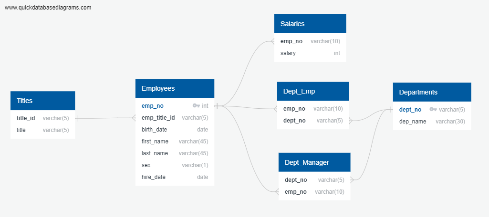

# SQL Challenge

## Background

This Challenge is divided into three parts: data modeling, data engineering, and data analysis.

## Data Modeling
Inspect the CSV files, and then sketch an Entity Relationship Diagram of the tables. 

## Data Engineering

- Create a table schema for each of the six CSV files. Be sure to do the following:

  - specify the data types, primary keys, foreign keys, and other constraints.

- Import each CSV file into its corresponding SQL table.

## Data Analysis
1.  List the employee number, last name, first name, sex, and salary of each employee.

2. List the first name, last name, and hire date for the employees who were hired in 1986.

3. List the manager of each department along with their department number, department name, employee number, last name, and first name.

4. List the department number for each employee along with that employee’s employee number, last name, first name, and department name.

5. List first name, last name, and sex of each employee whose first name is Hercules and whose last name begins with the letter B.

6. List each employee in the Sales department, including their employee number, last name, and first name.

7. List each employee in the Sales and Development departments, including their employee number, last name, first name, and department name.

8. List the frequency counts, in descending order, of all the employee last names (that is, how many employees share each last name).

